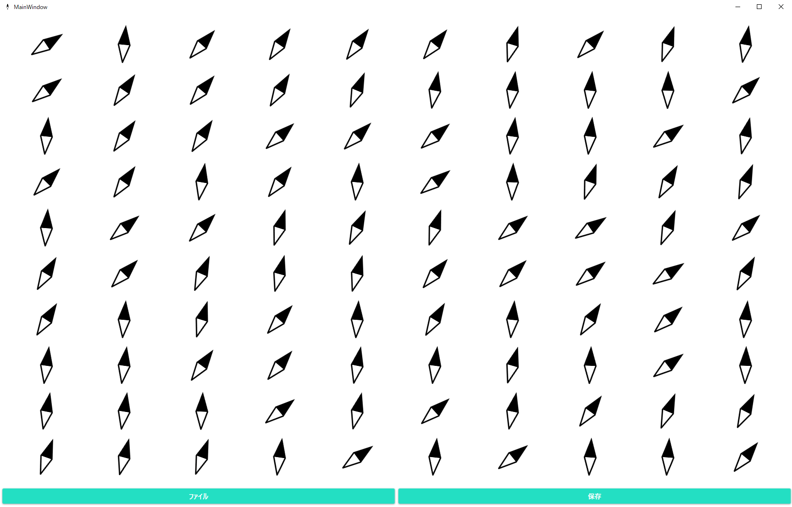
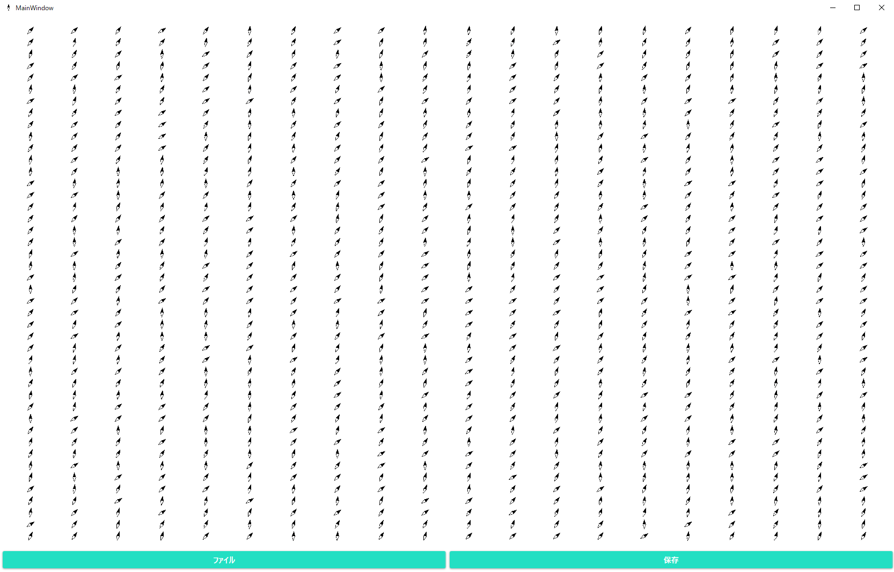
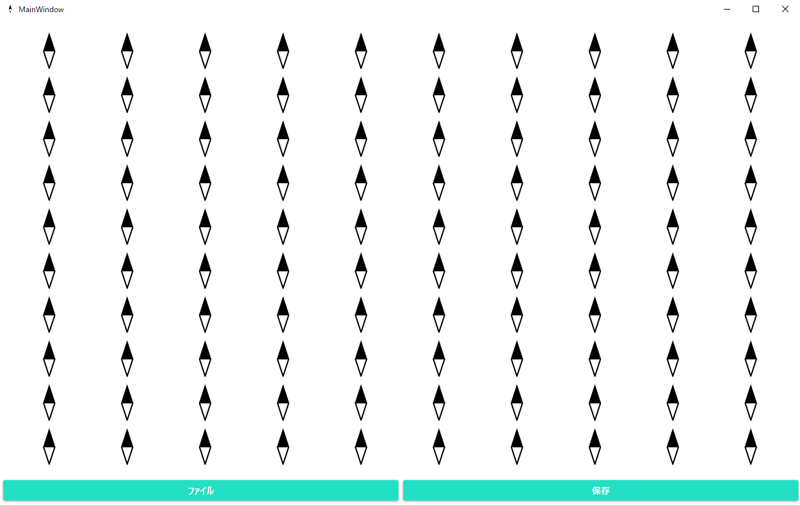

# CSVmagnetism

CSVmagnetismは某授業Aの課題におけるシミュレーション結果を可視化するソフトウェアです．

# DEMO

# Requirement
* WindowsOS

# Download
まだ

# How to use
起動後，画面左下のファイルボタンをクリックし，読み込みたいcsvファイルを選択します．

右下の保存ボタンを押すことで，現在の画面をpng形式で保存できます．

10行10列または44行20列のみの対応です．それ以外のファイルでは正常に動作しません．

# Author
つよぽん